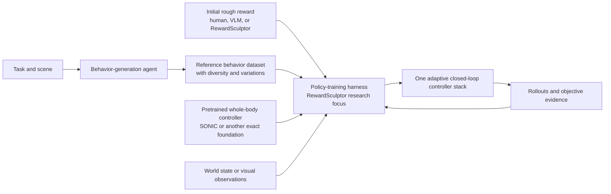

# RewardSculptor guiding research context

**Status:** canonical living research brief

**Last reconciled:** 2026-08-24

**Audience:** Sam, Lokesh, collaborators, and any agent opening this project in a
fresh window

This document is the current source of truth for the research direction. It
combines the first two meetings with Lokesh, the public literature, and an
audit of the code that exists today. `docs/RESEARCH_DIRECTION.md` remains a
useful record of the first meeting, but its proposed scope is historical where
it conflicts with this guide. `docs/STARTING_POINT_RESEARCH_WORKFLOW.md` remains
the detailed contract for the implemented upload and launch path.

## 1. Start here: the research in one page

The best current formulation is:

> Build an agentic policy-training harness that turns a diverse reference
> behavior dataset and an imperfect task reward into one adaptive,
> closed-loop controller stack, beginning from a pretrained whole-body
> controller and deliberately training the transition and recovery states that
> static reference tracking misses. The stack uses one low-level controller
> across modes, possibly commanded by a separate selector or task policy.

RewardSculptor should not be described as a model that directly generates
policy weights. It is an **agentic policy-training and evaluation harness**. It
selects and validates inputs, launches training, measures behavior with
reward-independent objectives, diagnoses failures from telemetry and rendered
evidence, and iterates on the training specification.

Lokesh's proposed system has two major blocks and a precise contract between
them:



The key scientific gap is not ordinary motion playback. A fixed reference can
work near its nominal state and still fail as a task controller. If a box
slides away during manipulation, a robust controller must transition from
manipulation to reacquisition, approach the new object pose, restore a useful
interaction geometry, and resume the task. Those off-reference transitions
are absent from a static clip library unless the training system creates and
samples them deliberately.

### The five layers that must remain separate

| Layer | What it does | Current owner/status |
|---|---|---|
| Behavior generation | Converts a semantic task and scene into structured reference behavior data and variations. | Lab/Sachin direction described by Lokesh; the transcript does not identify which public paper or release, if any, corresponds to the demonstration. Not implemented end to end in RewardSculptor. |
| Foundation motion control | Maps a motion command to stable G1 joint targets. | Public SONIC is the relevant example. RewardSculptor does not yet integrate it. |
| Visual behavior adaptation | Conditions task control on the actual scene so behavior changes with terrain or objects. | Lokesh showed an unpublished SONIC-initialized system. It is not the public SONIC tracker and is not in RewardSculptor. |
| Policy-training harness | Fine-tunes or trains a task policy from references, task reward, world variations, and rollout feedback. | This is RewardSculptor's strongest fit and Sam's likely research block. |
| Structured reference selection | Chooses which local reference or mode is useful as task state changes and supplies transition/recovery coverage. | OGMP motivates this. RewardSculptor currently implements only a fixed linear phase-window subset. |

## 2. What is confirmed, inferred, and still open

This document uses four confidence classes:

- **Confirmed by Lokesh:** stated clearly in the meeting transcript.
- **Confirmed by a public source:** stated in a paper, official project page,
  model card, or released code documentation.
- **Working synthesis:** the most coherent reconstruction of the meetings and
  literature, but not yet an agreed proposal.
- **Open:** requires Lokesh, the professor, or an implementation experiment to
  resolve.

The transcript contains substantial speech-to-text corruption. High-confidence
repairs include “Sony” → **SONIC**, “tablara rasa” → **tabula rasa**, “BLM/VNM”
→ **VLM**, “agent hardness” → **agent harness**, “question fiction” →
**coefficient of friction**, and “GCap” → **Google Calendar invitation**.
Garbled paper or field names near the end are deliberately not reconstructed
as citations.

## 3. What Lokesh asked Sam to do

The meeting-source provenance and compact dated decision history are retained
in [`meeting_notes/LOKESH_MEETINGS_SOURCE_LEDGER.md`](meeting_notes/LOKESH_MEETINGS_SOURCE_LEDGER.md).

### Immediate assignment before the next meeting

1. Draw an exact boundary around RewardSculptor: what works, what does not,
   and the technical failure modes behind unsuccessful motions.
2. Read SONIC and adjacent locomotion, whole-body control, loco-manipulation,
   manipulation, and optionally VLA work.
3. Reconstruct the architecture discussed in the meeting: behavior generation,
   reference dataset plus rough reward, policy training, pretrained-controller
   initialization, visual/environment adaptation, and longer-term automatic
   reference staging.
4. Identify missing elements in that architecture rather than merely restating
   it.
5. Use the resulting document to draft a research proposal.

Lokesh did not assign a new GPU result or hardware demonstration for this
week. The deliverable is a technically precise research analysis and proposal
seed.

### Administrative facts to carry forward

- Sam needs the directed-research credit to be **AME 590**, not AME 490.
- Sam prefers **two credits**; one nonzero credit would also be acceptable.
- Lokesh said AME 590 most likely should be possible after a research plan and
  the relevant professor/administrative process. This is not approval.
- A final report or presentation is likely, but the exact requirement was not
  resolved in the transcript.
- Sam thought the registration deadline might be September 11, but explicitly
  was not sure. Verify it independently; do not treat it as confirmed.
- Send a Google Calendar invitation for the follow-up after the draft. Use
  Google Chat for routine communication.

### First-meeting context that still matters

The first meeting established that Sam is unusually strong as a builder, but
Lokesh wants the project to develop research discipline: formulate a precise
problem, locate it relative to the literature, design falsifiable comparisons,
and resist shipping a compelling demo as though it were evidence. Motion
priors, pretrained tracking, structured modes, objective evaluation, domain
randomization, and eventual hardware work were all important themes.

The new meeting sharpens one major point from the older summary: the lab's
missing piece is not simply “reward generation.” Lokesh placed RewardSculptor
more broadly in the **policy-training block** and explicitly said Sam could do
more than author rewards. Reward iteration remains a component, not the whole
research definition.

Hardware remains a motivating long-term outcome, not a current entitlement or
success claim. The exact hours, authorship, IP terms, hardware access, project
ownership, and six-month scope still need to be agreed.

The durable first-meeting takeaways were:

| Theme | What carries forward | How the second meeting changes it |
|---|---|---|
| Motion prior | Use generated or retrieved reference motion to express time-varying whole-body intent. | References are now an explicit input contract, with diversity and variations, rather than merely a reward aid. |
| Pretrained tracker | Start from broad motor competence and use tracking to assess candidate motions. | SONIC is now the concrete foundation controller Lokesh wants Sam to understand and likely use. |
| Modes/stages | Sam's mission decomposition resembles OGMP's structured view of behavior. | The important problem is state-conditioned transitions and recovery coverage, not just fixed stage rewards. |
| Reward generation | RewardSculptor's reward iteration is a useful lab complement. | It is one function inside a broader policy-training harness, not the entire proposed contribution. |
| Objective trust | A generated reward cannot be allowed to grade itself. | This remains RewardSculptor's most mature scientific safeguard and should evaluate the new method. |
| Variations/DR | A task is a behavior under a distribution, not one nominal rollout. | The reference dataset itself must also carry meaningful variation and recovery coverage. |
| Environment awareness | Terrain, contacts, and manipulated objects change the control problem. | Lokesh's visual adaptation addresses feedback, but vision alone does not solve missing transition structure. |
| Agent harness | Replace ad hoc terminal prompting with explicit tools, evidence, and bounded edits. | The lab now has complementary behavior-generation and policy-training harnesses in mind. |
| Collaboration | Formal research could provide mentorship, lab integration, and eventually hardware. | The immediate next step is a scoped proposal and AME 590 process, not an assumed hardware result. |
| Professional development | Lokesh encouraged Sam to build technical depth and learn to formulate research problems precisely. | The weekly deliverable should name mechanisms, baselines, and evidence rather than report that a task was simply “hard.” |

### The complementary behavior-generation branch

Lokesh showed a lab agent that receives a semantic task, scouts a simulated
scene, uses tools and external research to resolve missing concepts, builds a
structured task/scene map, and produces reference behavior data. He associated
this direction with Sachin. The transcript does not establish its public
paper, released code, exact model, or final ownership boundary.

It also does not establish that this agent already generates trustworthy task
rewards. Lokesh said reward generation had not yet been explored in the same
depth and suggested that Sam could begin there while still owning more of the
policy-training loop. Therefore, the initial rough reward must remain an
independent input whose provenance can be human, VLM-generated, or
RewardSculptor-generated.

The cross-block contract still needs to be agreed. At minimum, ask whether it
contains reference clips, semantic segment labels, task/scene state, variation
dimensions, candidate mode structure, a rough reward, and an evaluation
protocol—and which of those fields are authoritative versus suggestions.

## 4. The technical argument behind the architecture

### Why reward-only training fails

A scalar reward is a local optimization signal. It can express task outcomes
and useful physical constraints, but it is a poor standalone description of a
high-dimensional motion evolving through time. In RewardSculptor's early G1
experiments, this appeared as several distinct failure classes:

- **Exploration failure:** the policy never reaches the narrow state region
  where a kick, jump, or acrobatic transition becomes learnable.
- **Temporal underspecification:** a single score does not identify the
  ordered joint and body evolution that constitutes the intended behavior.
- **Local optimum/reward hacking:** repetitive shuffling, oscillation,
  crouching, or partial progress earns dense shaping without completing the
  task.
- **Conflicting objectives:** balance, contact, progress, naturalness, and
  terminal behavior compete through manually chosen weights.
- **Sparse transition coverage:** separately solvable phases do not teach the
  controller how to move between them after a perturbation.

“The cartwheel was hard” is therefore not an adequate research diagnosis. A
useful diagnosis names which of these mechanisms failed, identifies the
evidence, and predicts an intervention that can be falsified.

### Why references help—and why they are not enough

A reference supplies dense temporal structure and places exploration near a
desired behavior manifold. The reference does not need to be the optimal
dynamic solution. As Lokesh explained, a choreographic or kinematic candidate
can still be valuable if it brings training near the relevant solution region.

But three claims must stay separate:

1. A kinematic reference describes a candidate motion.
2. A tracker demonstrates that a particular controller can reproduce that
   motion under a specified simulator and cadence.
3. A task policy demonstrates that the motion causes the desired object/world
   outcome and recovers when the state changes.

RewardSculptor's Tier K/Tier D distinction already enforces part of this
separation. Tier K is kinematic only. Tier D is exact simulated tracking
evidence for a frozen clip and interface. Neither is automatically a task,
hardware, contact, or perturbation-recovery certificate.

### The desired training recipe

The working recipe is:

```text
pretrained motion competence
    + reference behavior coverage
    + task reward
    + state/visual feedback
    + variation and recovery sampling
    + objective rollout evidence
    = one task-adapted closed-loop controller stack
```

Reference tracking moves the learner toward the behavior manifold. The task
reward supplies optimization pressure for the actual interaction. State or
vision makes feedback depend on the world. Perturbation sampling creates the
off-nominal states. Objective evidence prevents generated reward from
declaring its own success.

## 5. SONIC: what it is and what it is not

The public [SONIC project](https://nvlabs.github.io/GEAR-SONIC/) and
[paper (arXiv v4)](https://arxiv.org/html/2511.07820v4) describe a generalist
low-level whole-body motion tracker for the 29-DoF Unitree G1. It maps a
supported reference-motion command plus proprioceptive history to 29 desired
G1 joint positions tracked by joint-level PD controllers. The central result
is one unified policy trained at scale across robot, retargeted human, and
hybrid motion commands—not a separate controller for every skill.

### Public SONIC mechanics relevant to this project

- Motion tracking is the task-agnostic pretraining objective. The source
  collection contains approximately 700 hours. After retargeting to G1 and
  filtering infeasible motions, SONIC trains on 611 hours, 317,189 clips, and
  more than 100 million frames. Its largest model has 42 million parameters
  and was trained for roughly 21,000 GPU-hours using 128 GPUs for seven days.
- Specialized robot, human, and hybrid command encoders map heterogeneous
  motion inputs into a shared finite-scalar-quantized universal token space.
  The default public representation is two 32-dimensional tokens, exposed as
  a 64-dimensional command. A decoder combines that token with proprioception
  to produce robot control; an auxiliary decoder reconstructs robot motion.
- The G1 control policy runs at 50 Hz and outputs desired joint positions for
  a lower-level PD controller. The paper's actor uses a ten-step history of
  joint positions, joint velocities, root angular velocity, root-frame
  gravity, and prior actions, plus a short-horizon motion command. The
  asymmetric critic can use privileged simulation state.
- The tracking objective is dense: it includes reference tracking and
  regularization terms. “No manual task reward engineering” means the broad
  pretraining does not require a separate semantic task reward for each
  motion; it does not mean the tracker has no engineered training objective.
- Domain randomization, perturbations, and command noise are used to improve
  robustness.
- A separate kinematic planner can generate short transitions for interactive
  behaviors, and separate upstream generators can supply text, music, video,
  VR, or keypoint motion commands.

SONIC performs local motion tracking rather than following a globally fixed
root trajectory. References are heading-aligned to the robot when a motion
begins; global placement, object-relative intent, and replanning come from an
upstream planner or task policy. “Universal” refers to the breadth of supported
motion commands and input sources, not universal adaptation to arbitrary world
state. The paper also reports that extreme commands can still lose balance and
that sustained or complex ground-contact motions remain difficult; it does not
provide formal safety or long-duration energy guarantees.

The official [GR00T whole-body control release](https://nvlabs.github.io/GR00T-WholeBodyControl/)
now exposes checkpoints, training/configuration documentation, deployment
artifacts, and motion data. Public model variants use a 64-dimensional
universal token at 50 Hz; their exact lookahead, history, encoder/decoder, and
normalization contracts vary and must be pinned rather than inferred from the
name “SONIC.”

### Does a SONIC reference specify every joint?

It depends on the command modality:

- A robot-motion command provides future G1 joint positions and velocities, so
  it can explicitly describe all 29 controlled joints.
- A human-motion command supplies future human 3D joint positions, not a G1
  angle for every actuator.
- A hybrid command supplies current head/hand keypoints plus future lower-body
  robot motion.

The modality encoder and shared token representation bridge those formats.
This is different from OGMP: the original OGMP oracle uses a coarse
13-dimensional single-rigid-body state and intentionally leaves actuated joint
motion for the policy to discover.

### The three SONIC-related systems that must not be conflated

1. **Public SONIC tracker:** a camera-free low-level motion controller. Its
   actor does not itself reason over RGB images.
2. **Public SONIC + VLA demonstration:** for four whole-body tasks, a separately
   fine-tuned GR00T N1.5 VLA predicts a 64-dimensional SONIC motion token plus
   14 hand-joint commands. The apple-to-plate task instead uses a three-point
   command through the kinematic planner and hybrid encoder. Visual and
   semantic autonomy comes from the upstream VLA; the public paper does not
   fine-tune SONIC for those semantic tasks.
3. **Lokesh's visual behavior-adaptation work:** an unpublished architecture
   that begins from SONIC weights and fine-tunes with visual/environmental
   input so behavior adapts to terrain and objects. It should not be attributed
   to the public SONIC paper until the preprint establishes the details.

Likewise, the VLM behavior-generation agent Lokesh showed is a separate
upstream system. He explicitly said that the policy-training formulation he
was describing need not contain a VLM in the low-level loop; an oracle or
reference selector can identify the applicable reference during training.

### What SONIC changes for RewardSculptor

The intended baseline is no longer random initialization whenever a compatible
foundation controller is available. The central question becomes how to adapt
strong motion competence to a task, not how to relearn balance and locomotion
for every experiment.

RewardSculptor does **not** currently integrate SONIC. Its Tier-D certifier
trains a fresh task-specific tracker. It has no SONIC encoder/decoder pair,
64-D token interface, future-reference contract, official motion-library
adapter, or observed runtime proof of SONIC execution.

The existing hostile-upload boundary must not be weakened to add it. Public
SONIC training and deployment use artifacts such as PyTorch checkpoints,
pickle motion libraries, and paired ONNX components that RewardSculptor
correctly refuses from arbitrary uploads. Integration should use a trusted,
pinned local or provider adapter that verifies the complete model pair,
configuration, observation/action contract, ordered joints, cadence,
normalizers, software versions, license, and exact bytes. Converting one file
to safetensors would not solve the architectural mismatch.

## 6. OGMP and what “modes” actually mean

[Oracle Guided Multi-mode Policies (arXiv v3)](https://arxiv.org/html/2403.04205v3)
trains a single policy across task-vital modes using a closed-loop,
receding-horizon oracle. The oracle supplies a finite-horizon state reference
from the current state. A permissible deviation bound, denoted \(\rho\),
constrains the weighted deviation
\(\lVert x_t^\pi-x_t^\Xi\rVert_W\); the paper implements a violation as episode
termination. The weighting \(W\) determines which coordinates matter and is
sparse in the reported parkour and dive experiments. Too-small \(\rho\) can
exclude the true optimum, while too-large \(\rho\) admits local optima, so the
paper denotes an unknown oracle error bound \(\epsilon\) and grid-searches
\(\rho\) in practice. The resulting policy is deliberately local: states
outside the oracle's \(\rho\)-neighborhood may fail.

In the published implementation, a 32-unit LSTM autoencoder compresses oracle
trajectory windows into a two-dimensional mode latent. The oracle reference is
a coarse 13-dimensional single-rigid-body state, not an all-joint reference.
The latent is an externally supplied command produced by that separately
trained autoencoder, not a hidden stage inferred by the control policy. The
recurrent policy receives proprioception, the external latent, a clock, and
optional task feedback, then learns the detailed joint motion and transitions.
In the parkour ablation, the latent's main value was commandability and reuse;
it did not improve task performance when terrain feedback and the clock were
already present.

The reference is not necessarily a full pose for every joint. OGMP can use
coarse state guidance, such as base-level reference quantities, while the
policy discovers joint-level motion under physics. Thus an oracle is better
understood as a state-conditioned generator of locally useful future
constraints than as a movie the robot blindly replays.

[Preferenced OGMP](https://arxiv.org/abs/2410.01030) extends this idea to
dynamic bipedal loco-manipulation. A hybrid-automaton oracle uses environment
feedback to select exactly three modes: reach, manipulate, and detach. Its
sparse preference penalty discourages the current mode rank from falling below
the highest rank previously reached, but does not prohibit regression.
Recovery therefore comes from retaining backward transitions—for example,
manipulate → reach when the object escapes—not from a separate recovery mode.
The result remains one task policy across modes rather than one task policy per
mode.

OGMP does not patch together prerecorded full-joint clips. Its hand-designed
oracle generates coarse finite-horizon state references for user-defined
modes, and RL learns the detailed joint behavior and transitions. Selecting or
stitching a reference library is Lokesh's proposed re-instantiation of the
idea, not the mechanism demonstrated in the OGMP paper.

### Lokesh's proposed reinterpretation

Lokesh said something “like OGMP” is needed, but not simply a copy of the old
implementation. The reference dataset may contain walking, approaching,
lifting, flipping, and other local behaviors. An agentic harness should infer
or construct a task-level staging mechanism, supply the right reference near
each state, and create dense training coverage across transitions. The learned
low-level policy should ultimately perform the transitions and recovery, not
merely switch between unrelated controllers.

Two details remain open and materially change the method:

- **Online-reference deployment:** keep a state-conditioned selector/oracle and
  reference input at inference.
- **Training-only guidance:** use oracle references and reference-based
  terminations during training, then deploy without the oracle. Preferenced
  OGMP explicitly does this: inference is independent of the oracle and
  reference-based terminations are disabled, while the recurrent policy still
  receives proprioception, relative robot/object/target state, and a reference
  phase. VideoMimic is the separate example that uses DAgger distillation to
  remove target-joint and root-roll/pitch conditioning.

This choice must be asked explicitly rather than hidden behind the phrase
“the policy knows the stage.” A policy only has the information encoded in its
observations, memory, or external command.

“One policy” here means one task policy spans all modes instead of one task
policy per mode. A hierarchical SONIC system may still contain a high-level
task policy and a separate frozen foundation controller.

### RewardSculptor's implemented OGMP boundary

Current support is an **OGMP-inspired fixed linear phase-window automaton**:

- a composed clip can have immutable ordered phase windows;
- a frozen playback clock is installed in both actor and critic;
- per-mode generated reward terms can be scoped and firewalled;
- training and evaluation share a digest-bound execution manifest;
- offline mode and transition diagnostics can be recorded.

It does not yet implement:

- a receding-horizon oracle queried from the current state;
- \(\rho\)-bounded permissible-state exploration;
- live general mode guards, branches, or recovery transitions;
- a learned mode latent or task-feedback-conditioned OGMP policy;
- preference-conditioned transition behavior;
- automatic reference decomposition or stitching from a behavior dataset.

A separate task-specific route → jump → hold event program has live predicate
transitions. It is valuable plumbing, but it is not a general OGMP executor and
must not be used to overstate the mode implementation.

## 7. Adjacent work and the boundary it clarifies

- [Visual Whole-Body Control](https://arxiv.org/abs/2403.16967) is a Unitree B1
  quadruped plus Z1 arm system, not a G1 humanoid result. It distills a
  privileged high-level policy into a visual policy that consumes segmented
  depth and masks, then commands end-effector pose, base velocity, and gripper
  state over a fixed 50 Hz low-level controller. It supports hierarchical
  visual adaptation and retry behavior, not general VLM reasoning or the
  details of Lokesh's unpublished G1 system.
- [VideoMimic](https://arxiv.org/abs/2505.03729) reconstructs human motion and
  scene geometry from monocular video, tracks the demonstrations in
  height-mapped environments, then DAgger-distills and PPO-fine-tunes one G1
  policy. At deployment it observes proprioception, an 11×11 local height map,
  and a desired root-direction command; it does not observe RGB or infer a
  semantic task, and it no longer receives target joint angles or target root
  roll/pitch.
- SONIC's public VLA connection shows a VLA predicting the shared motion token
  for a low-level tracker. This is a plausible interface for hierarchical task
  adaptation, not proof that SONIC itself sees or understands the scene.

The durable architectural pattern is: semantic/visual task reasoning and
motion generation upstream; a strong low-level motor prior downstream; and a
clearly specified interface between them.

| System | Deployment input → output | Reference/oracle role | Vision location | Demonstrated recovery boundary |
|---|---|---|---|---|
| SONIC | Proprioceptive history + supported motion command → 29 desired G1 joint positions | Local motion command remains an input | None in the SONIC actor; planner/VLA may be upstream | Perturbation-robust tracking, not semantic object reacquisition |
| OGMP | Proprioception + external 2-D mode latent + clock + optional task feedback → recurrent policy action | Closed-loop oracle and \(\rho\) constraint during training | None | Learned mode transitions within the oracle-supported neighborhood |
| Preferenced OGMP | Proprioception + relative task state + phase → one recurrent task policy | Hybrid oracle/terminations train-only; no oracle at inference | None | Backward mode transitions enable simulated object/task recovery |
| Visual Whole-Body Control | Segmented depth/masks → high-level end-effector/base/gripper command → fixed low-level controller | Privileged teacher then visual student | High-level policy | Task-specific retrying on B1+Z1, not general semantic planning |
| VideoMimic | Proprioception + local height map + root-direction command → G1 control | References used for tracking and DAgger training, then reduced deployment conditioning | Scene geometry/height map, not deployment RGB | Contextual terrain behavior; not language-directed object recovery |
| Proposed study | Privileged object state first, later frozen vision → task command or adapted controller | Fixed, manual, then automated curriculum compared explicitly | Separate H3 ablation | Same-episode cube reacquisition and resumed manipulation |

### Public reference-generation resources

[Kimodo](https://research.nvidia.com/labs/sil/projects/kimodo/) is a public
kinematic motion-diffusion model controlled by text, full-body keyframes,
sparse joint constraints, 2D waypoints, or dense paths. It can export G1
trajectories that SONIC tracks or that downstream training can use as
demonstrations. Kimodo is a reference generator, not a physics controller, VLM
research agent, or dynamics-feasibility certificate.

[BONES-SEED](https://huggingface.co/datasets/nvidia/BONES-SEED) provides a
large motion corpus, and its public timeline annotations divide motions into
timestamped, language-described atomic segments. Those annotations are useful
for retrieval and for proposing candidate mode boundaries. They do not supply
task-success predicates, transition guards, environment feedback, dynamic
feasibility, or an OGMP oracle. A semantic segment label must not silently
become a control-authority claim.

## 8. Exact current position of RewardSculptor

### Implemented and useful now

| Capability | Current evidence-backed truth |
|---|---|
| Agentic training loop | Generates and validates rewards, trains PPO, rolls out, computes independent evidence, diagnoses failures, applies scoped reward/environment/world edits, selects or reverts, and repeats. |
| Objective trust | Generated and built-in metrics are sandboxed, calibrated, and kept independent from generated reward. All-lane trajectory, contact, fall, posture, physical-scene, and naturalness evidence exist. |
| Reference library | G1 clips can be ingested, searched, retargeted, segmented, cropped, and composed with immutable provenance and root-frame checks. |
| Tiered admission | Tier K is kinematic; Tier D binds exact simulated tracker evidence, cadence, embodiment, interface, and bytes. |
| Reference conditioning | A normalized immutable reference clock is consumed by both actor and critic in training and rollout. This supports one fixed reference schedule, not general reference understanding. |
| Policy starting points | From-scratch, exact project checkpoint, and sanitized portable `.rskill` actor/critic initialization are separately selected and verified by observed runtime load events. |
| World and variation substrate | Authored worlds, domain randomization, RSI, object-relative geometric observations, regions, contacts, and task-specific event phases can be used. |
| Mode scaffold | Fixed ordered phase windows, per-window reward scope, immutable execution manifests, and diagnostics are implemented. |
| Offline VLM critique | Metrics and four rendered rollout keyframes can be reviewed between iterations. This is not online visual control or full-video temporal reasoning. |
| Provenance/KG | Exact artifacts and earned runtime relations distinguish policy initialization, reference tracking, active world, mode execution, and produced evidence. |

### Not implemented or not yet proved

| Missing capability | Why it matters |
|---|---|
| SONIC integration | There is no trusted SONIC adapter, token interface, encoder/decoder execution, or runtime lineage. |
| First-class behavior-set × variation contract | A research task needs multiple reference variants and an immutable per-episode sampler, not a single selected clip. |
| Visual policy observations | The target G1 actor does not consume camera features. Rendered RGB is only evidence for offline diagnosis. |
| Closed-loop reference oracle | No runtime component selects or regenerates a reference from current object/world state. |
| General transitions and recovery | There is no branchable mode graph or validated reacquisition behavior after an object displacement. |
| Automatic transition-data generation | The system does not mine failures and generate missing bridge/recovery references. |
| Full-video rollout reasoning | Four keyframes cannot reliably capture temporal failures or recovery attempts. |
| Arbitrary controller architectures | Upload accepts bounded data-only portable weights under exact known contracts. It never executes uploaded controller code. |
| Hardware proof | No current result establishes sim-to-real success for this proposed architecture. |

The active G1 reference-guided rail-hop project is useful integration evidence
for immutable references, policy clocks, mode windows, reward firewalls, and
physical metrics. It is not the right scientific benchmark for adaptive
object-task recovery and should not be presented as one.

### Researcher UX boundary

The New Run UI honestly separates starting policy, starting motion, and active
world and exposes an exact receipt. That is a strong foundation. It still lacks
a first-class trusted SONIC provider, a concise compatibility diff, a UI action
for Tier-D certification, a simple behavior-dataset bundle builder, and a
researcher-facing variation sampler. “Imported skill” can also sound more
executable than the safe reality: only compatible server-admitted policy and
reference data become active; uploaded code, controller descriptions, and
world declarations do not.

## 9. The actual research gap

The current system can optimize a policy around one immutable reference and
one world distribution. The lab's desired controller must remain competent as
the world moves away from the nominal reference. The missing mechanism is a
closed loop between observed failure, reference/mode coverage, and policy
training.

### Candidate research question

> With the task reward, pretrained G1 controller, and training budget held
> fixed, can an automatically constructed state-conditioned recovery
> curriculum improve cube-face reorientation after object displacement
> relative to a fixed reference and a manually authored mode curriculum?

### Staged hypotheses

**H1 — structure:** under the same controller, reward, and optimization budget,
a manually authored state-conditioned oracle/curriculum will improve
perturbed-task completion over fixed-reference training.

**H2 — automation:** under matched rollout, reference, compute, and human-edit
budgets, automatically mined transition/recovery coverage will match or exceed
the manual curriculum on sealed-test recovery while requiring fewer human
edits.

**H3 — perception:** after H1/H2 are established with privileged object state,
a frozen visual representation can replace that state with a measurable and
separately attributable performance cost.

The primary H2 prediction is higher sealed-test perturbed-task completion and
lower reacquisition latency than fixed-reference training, with nominal success
and safety remaining non-inferior. Reward editing, vision, and controller
architecture changes are separate experimental arms so that a positive result
has an identifiable cause.

These hypotheses are not yet Lokesh-approved. They are a proposal seed designed
to be falsifiable and feasible for a small directed-research scope.

### Novelty audit still required

“Automatic recovery curriculum” is not a novelty claim by itself. Before the
proposal fixes its contribution, compare the method against skill chaining,
options and hierarchical RL, automated curricula/adversarial environment
generation, failure-driven reset-state sampling, DAgger-style corrective data
aggregation, residual policy learning, and goal-conditioned manipulation. The
claim should identify the exact new combination or algorithm only after that
review—for example, immutable reference-coverage edits selected by objective
failure evidence under a matched human/compute budget.

## 10. Recommended first benchmark

Use a new project rather than extending the rail-hop showcase. The clearest
benchmark is the failure Lokesh described: a G1 must turn or push a box to a
specified face/pose—use **red face up** as the first fixed target—but friction
or an external perturbation can displace the box after contact.

Before collecting results, the benchmark manifest must precommit robot and
object initial-state ranges, cube geometry/mass/friction, end-effector/contact
geometry, target orientation tolerance and dwell, fall and forbidden-contact
rules, perturbation timing/magnitude/direction, episode horizon, and all data
splits. No-perturbation control episodes measure nominal competence.

### Required behavior

1. Approach and establish a useful manipulation pose.
2. Begin the turn/push behavior.
3. After the first verified manipulation contact, experience a recorded
   displacement event and detect that the nominal reference is no longer
   applicable.
4. Reorient and reacquire the object.
5. Resume the manipulation and reach the target face/pose.
6. Finish safely and stably.

Endogenous low-friction slip and an exogenous impulse or pose displacement are
different conditions and must be reported separately. Recovery success is
conditioned on proof that the perturbation occurred and requires same-episode
reacquisition, resumed manipulation, final target success, and safety. A reset
into an easier state does not count as deployment recovery.

### Controlled progression

1. Reproduce one exact foundation-controller tracking rollout and verify its
   complete interface.
2. Exact simulator object state, fixed rough reward, fixed reference, and one
   controller/optimization budget.
3. Manual state-conditioned oracle and recovery curriculum.
4. Agent-generated transition/recovery curriculum under the same privileged
   state and matched budget.
5. Learned selector, visual representation, reward co-editing, and hardware as
   separate later studies only after the core comparison is interpretable.

Starting with privileged state isolates whether structured coverage solves the
control problem. Adding vision too early would make perception and control
failures indistinguishable.

### Core comparisons and later ablations

| Comparison | What it isolates |
|---|---|
| Fixed reference and fixed phase schedule | Open-loop reference baseline. |
| Budget-matched random/open-loop mode sampler | Whether extra reference exposure alone explains improvement. |
| Manually scripted state-conditioned oracle | Upper bound and H1 test for closed-loop selection/coverage. |
| Automated curriculum versus manual oracle | H2 test under matched rollout, reference, compute, and human-edit budgets. |
| From-scratch PPO + the same task reward | Optional diagnostic for the value of the motion prior, not the primary comparison. |
| Privileged object state versus frozen visual representation | Later H3 ablation, not a core baseline. |

The policy/controller architecture and task reward stay fixed for H1/H2. Reward
co-editing can be evaluated later as a factorial arm rather than silently
changing along with the curriculum.

### Metrics and evidence

- **primary:** sealed-test perturbed-task completion;
- nominal task success as a non-inferiority and safety guardrail;
- reacquisition latency measured from the verified perturbation event, plus
  path length;
- final object pose/face accuracy;
- falls, forbidden contacts, slip, and intervention count;
- motion naturalness, tracking error, and energy/jerk;
- stratified robustness by perturbation type, direction, and severity;
- compute and human-edit budget to reach the accepted policy.

Use three immutable splits: training perturbations, agent-visible validation
perturbations used for diagnosis/selection, and a sealed final test with
held-out perturbation directions or families—not merely new seeds. Precommit
thresholds and budgets; use paired/common random seeds where possible and
report uncertainty intervals over all episodes. A precommitted trajectory lane
provides conjunctive visual proof of task completion, recovery, safety, and
naturalness, but it cannot replace population statistics or be cherry-picked.

“Correct mode transition” is only a primary metric if the task externally
requires a specific transition. Otherwise it is diagnostic: task competence
should not be penalized for finding a different valid decomposition.

## 11. Three materially different SONIC integrations

Lokesh should choose which scientific object he wants Sam to own:

### A. Fine-tune SONIC itself

This is the transcript-aligned default: Lokesh described fine-tuning from
SONIC rather than training tabula rasa. It has the highest integration and
compute cost and requires the exact released training stack plus any
lab-specific architecture. The public paper establishes motion-tracker
training and a separate VLA-on-token interface; it does not establish the
unpublished visual/task fine-tuning recipe.

### B. Freeze SONIC; train a high-level token-command policy

This is a tractability alternative, contingent on validating the exact
released or lab token interface. A compact task policy observes task/object
state and commands the exact quantized SONIC token representation. Public VLA
work supports this hierarchy, but the token is not an arbitrary 64-vector: the
quantization configuration and decoder identity are part of the controller
contract.

A bounded residual-action policy is a separate proposed interface with a
different action space and safety contract. It must be designed and validated
independently rather than being presented as an existing SONIC capability.

### C. Use SONIC only as a motion feasibility filter

Simplest integration. Candidate reference behaviors are admitted when the
trusted tracker can execute them. This improves dataset quality but tests less
of the adaptive-policy question and may reject useful novel motions outside
the tracker's repertoire.

None of these choices is implied merely by “start from SONIC.” They require
different interfaces, compute, baselines, and claims.

## 12. Proposed policy-training harness

Before building a general provider abstraction, pass a feasibility gate:
obtain the exact lab or public SONIC stack, reproduce one released G1 tracking
rollout, verify which encoder, decoder, checkpoint, critic, normalizers,
reference lookahead, and hand/end-effector interfaces can be continued, and
confirm the box task is compatible. Then integrate the smallest exact adapter.

The simplest defensible harness is:

1. **Admit inputs.** Pin the foundation controller, reference set, task reward,
   world distribution, observations, and evaluation contract independently.
2. **Build a behavior program.** Define local modes, applicability regions,
   transition guards, and initial perturbation curriculum.
3. **Train one controller stack.** Use reference tracking for local motion
   structure; the task reward supplies optimization pressure for the physical
   outcome.
4. **Evaluate independently.** Run nominal and agent-visible validation
   perturbations; retain trajectories, contacts, mode transitions, videos, and
   objective metrics. Do not open the sealed test until selection is complete.
5. **Diagnose coverage gaps.** Classify failures as perception, selection,
   reference coverage, transition coverage, reward, dynamics, or policy
   optimization failures.
6. **Expand only the missing coverage.** The first agent may retrieve, select,
   crop, or compose admitted references; add bounded RSI/reset states; revise
   guards; and change curriculum sampling. Every candidate reference must pass
   the existing kinematic and exact Tier-D admission path. Reward edits are a
   separate experimental arm. Novel reference generation is not claimed until
   an actual generator and admission path exist.
7. **Repeat with lineage.** Every iteration pins requested inputs separately
   from observed runtime facts and compares against fixed baselines. Stop at a
   precommitted rollout/compute/edit budget or when validation improvement
   remains below a precommitted threshold for the specified number of rounds.

The agent should initially edit data and declarative contracts, not arbitrary
controller code. This keeps the system reviewable, safe, and scientifically
attributable.

### Proposed input package

A future behavior package should remain data-only and contain:

- task and success specification;
- robot/adapter/interface contract;
- immutable reference clips or provider identifiers;
- variation dimensions and bounded distributions;
- mode candidates and optional guard declarations;
- rough task-reward specification;
- world/scene provenance;
- expected observations, controller interface, and cadence;
- objective evaluation protocol;
- immutable train/validation/sealed-test split identities;
- licenses and content hashes.

It should never contain executable uploaded policy/controller code. Trusted
providers may resolve named local controller implementations under an audited
adapter.

## 13. Knowledge-graph model

The knowledge graph should represent scientific claims and runtime evidence as
different things. The desired topology is:

```mermaid
flowchart TD
    Paper -->|REPORTS| Claim
    Claim -->|ABOUT| Technique
    Claim -->|SUPPORTED_BY| PublishedEvaluation
    Technique -->|MOTIVATES| ResearchCapability
    ResearchCapability -->|HAS_STATUS| CapabilityStatus
    BehaviorPackage -->|CONTAINS| ReferenceSet
    BehaviorPackage -->|CONTAINS| RewardSpec
    BehaviorPackage -->|CONTAINS| VariationSpec
    BehaviorPackage -->|CONTAINS| EvaluationProtocol
    EvaluationProtocol -->|DEFINES| DataSplit
    ReferenceSet -->|CONTAINS| ReferenceMotion
    VariationSpec -->|SAMPLES| EpisodeVariation
    ModeGraph -->|DECLARES| Mode
    ModeGraph -->|DECLARES| Guard
    ModeGraph -->|DECLARES| Preference
    OracleRuntime -->|IMPLEMENTS| ModeGraph
    OracleRuntime -->|QUERIED_WITH| EnvironmentFeedback
    OracleRuntime -->|PRODUCES| ReferenceHorizon
    OracleExecution -->|INSTANCE_OF| OracleRuntime
    OracleExecution -->|SELECTED| ReferenceMotion
    FoundationController -->|CONSUMES| ControllerCommand
    DirectTaskPolicy -->|INITIALIZED_FROM| FoundationCheckpoint
    HighLevelPolicy -->|COMMANDS| FoundationController
    TrainingRun -->|QUERIES| OracleExecution
    TrainingRun -->|USES| ReferenceHorizon
    TrainingRun -->|ENFORCES| RhoConstraint
    RhoConstraint -->|BOUNDS| RolloutState
    TrainingRun -->|INITIALIZED_FROM| PolicyArtifact
    TrainingRun -->|TRACKS| ReferenceMotion
    TrainingRun -->|EXECUTES_IN| WorldArtifact
    TrainingRun -->|USES_MODE_EXECUTION| ModeExecutionArtifact
    TrainingRun -->|PRODUCED| EvaluationArtifact
    EvaluationArtifact -->|EXHIBITS| FailureCase
    FailureCase -->|MOTIVATES| CoverageEdit
```



Current OGMP paper-to-capability status is mostly accurate. The next KG pass
should add SONIC and the adjacent visual/distillation sources, plus explicit
capabilities for:

- `reference_clock_conditioning = implemented`;
- `learned_mode_latent_conditioning = unsupported`;
- `ogmp_task_feedback_conditioning = unsupported`;
- `trusted_sonic_controller_execution = unsupported`;
- `behavior_set_variation_sampling = unsupported`;
- `online_visual_policy_conditioning = unsupported`;
- `offline_vlm_keyframe_diagnosis = implemented`;
- `perturbation_reacquisition_benchmark = unsupported`.

The literature-to-claim map should be kept this narrow:

| Source | Grounds | Does not ground |
|---|---|---|
| SONIC | One scaled 29-DoF G1 tracker; robot/human/hybrid encoders; shared FSQ tokens; tracking robustness; planner/VLA interfaces. | Camera-conditioned low-level control, semantic task planning, displaced-object recovery, or RewardSculptor integration. |
| OGMP | Closed-loop receding-horizon oracle, \(\rho\)-bounded exploration, compact learned mode latent, one recurrent multi-mode policy. | Offline clip concatenation, all-joint reference playback, or current RewardSculptor phase windows. |
| Preferenced OGMP | Hybrid-automaton oracle with environment feedback and recoverable mode preferences for simulated loco-manipulation. | Sim-to-real proof, visual perception, or automatic VLM mode discovery. |
| Visual Whole-Body Control | Modular high-level visual policy over universal low-level control; privileged teacher/student pattern. | The details of Lokesh's unpublished G1 architecture. |
| VideoMimic | Video/scene reconstruction, reference tracking, and distillation into contextual humanoid control. | SONIC architecture or a general online OGMP oracle. |
| Kimodo/BONES-SEED | Kinematic motion generation, semantic retrieval, and candidate temporal segmentation. | Dynamic feasibility, success predicates, transition guards, or task recovery. |

If SONIC is frozen beneath a new policy, provenance needs a relation such as
`COMMANDS_CONTROLLER` or `USES_CONTROLLER`; `INITIALIZED_FROM` is correct only
when SONIC weights actually initialize the trained network. The exact encoder,
decoder, observation configuration, cadence, normalizers, software, and hashes
must form one compound controller identity. Declaration and execution must
also stay separate: a ModeGraph can declare possible guards and references,
but only an observed OracleExecution earns a `SELECTED` edge. Training-time
and inference-time oracle use, ObservationSpec identity, and immutable data
splits must be explicit rather than inferred from the graph's presence.

## 14. Decisions, uncertainties, and questions for Lokesh

### Highest-priority research questions

1. Is Sam's primary deliverable the full policy-training harness, automatic
   reward iteration, or the state-conditioned reference/recovery mechanism?
2. Should the first controller fine-tune SONIC, command a frozen SONIC token
   interface, or use SONIC only as a feasibility filter?
3. Does the final task policy receive reference/oracle commands at inference,
   or is the oracle training-only, with guidance removed through recurrent
   policy training or an explicit distillation stage?
4. What exact lab code, checkpoint, visual encoder, simulator, and reference
   data can Sam use, and under what license/access constraints?
5. What is the contract from Sachin's behavior-generation block: clips,
   scene state, variations, task graph, rough reward, or all of these?
6. Is the selector initially a hand-authored oracle, hybrid automaton, planner,
   or learned model?
7. What benchmark best exposes the lab's real failure mode and is feasible for
   an AME 590 timeline?
8. Which baselines, seed count, sealed perturbation families, and success
   metrics would make the study technically defensible and potentially
   publishable?
9. Is vision part of Sam's first method or a second-stage ablation after
   privileged-state recovery works?
10. What compute budget and hardware milestone are realistic?

### Administrative questions

1. Can the work be registered for AME 590, for two credits if possible?
2. Who is the supervising faculty member and what approval form is required?
3. What is the actual registration deadline?
4. What final report, presentation, or demonstration is required?
5. What are the expected weekly hours, meeting cadence, authorship criteria,
   repository/IP rules, and publication target?

## 15. Proposal seed

### Working title

**Agentic Transition and Recovery Training for Reference-Conditioned Humanoid
Task Policies**

### Motivation

Large-scale motion trackers provide broad motor competence, while behavior
generators can produce nominal references. Neither alone creates a task policy
that can recover when object or terrain state leaves the nominal reference.
Manual reward and curriculum engineering remains the bottleneck between these
components.

### Proposed contribution

Develop a provenance-preserving policy-training harness that detects
off-reference failure regions, expands a structured mode/reference curriculum,
and fine-tunes or commands one pretrained humanoid foundation controller so a
single closed-loop controller stack covers nominal behavior, transitions, and
recovery.

### Evaluation claim to test

With controller, reward, and optimization budget fixed, the automated
curriculum improves sealed-test perturbation recovery over static reference
tracking and matches or exceeds a manually staged curriculum with fewer human
edits, while nominal success and safety remain non-inferior.

### Minimum defensible study

One G1 red-face-up cube task, privileged object state, one simulator, one exact
foundation-controller interface, a fixed rough reward, fixed/manual/automated
curricula, multiple paired seeds, immutable train/validation/sealed-test
splits, and a complete objective evidence package. Vision, learned perception,
learned mode selection, hardware, reward co-editing, and automatic novel-motion
generation are extensions—not prerequisites for testing the core
transition-coverage claim. Publication potential must be judged after results
and related-work comparison; this scope does not guarantee it.

## 16. Near-term work plan

### Before the next Lokesh meeting

- Review and edit this guide in Sam's own words.
- Confirm the AME 590 administrative path and deadline.
- Ask Lokesh to resolve the three SONIC integration choices and the inference
  reference question.
- Obtain the unpublished visual-adaptation preprint or architecture notes when
  shareable.
- Choose one benchmark and write its nominal/perturbed evaluation contract.
- Turn the proposal seed into a one- to two-page draft after those choices.

### First implementation milestone after scope agreement

- Create a new project and immutable benchmark manifest.
- Obtain the exact SONIC/lab stack and reproduce one released G1 tracking
  rollout before designing a general provider abstraction.
- Choose fine-tuning or a frozen token-command hierarchy with Lokesh; pin and
  admit the exact model/config/interface without changing upload safety.
- Implement that one minimum controller path and prove it in train and rollout
  receipts.
- Add behavior-set × variation sampling with per-episode provenance.
- Establish the fixed-reference baseline before adding an agentic selector.

### Research sequence

1. Fixed reference, privileged state, nominal task.
2. Fixed reference under displacement perturbations.
3. Manual state-conditioned oracle and recovery curriculum.
4. Budget-matched agentic failure mining and coverage expansion.
5. Only then: learned selector/token policy and reward co-editing as separate
   studies.
6. Visual observation ablation.
7. Hardware only after the simulation contract is stable.

## 17. Guardrails against overclaiming

- Do not call the VLM the controller. SONIC is the public foundation
  controller; other models may command it.
- Do not claim public SONIC has camera input or visual task reasoning.
- Do not attribute Lokesh's unpublished visual adaptation to the SONIC paper.
- Do not describe RewardSculptor as SONIC-integrated today.
- Do not say the system generates arbitrary policy architectures or executes
  uploaded controllers.
- Do not call fixed phase windows full OGMP.
- Do not say there is one controller per mode.
- Do not say “the policy knows the stage” without naming the observation,
  latent, oracle command, or memory that carries that information.
- Do not claim a reference is optimal, dynamically feasible, task-successful,
  or hardware-ready without the corresponding evidence.
- Do not use a visually plausible video or high training reward as acceptance.
- Do not claim closed-loop recovery until the same episode proves displacement,
  reacquisition, resumed manipulation, task completion, and safety.
- Do not claim AME 590 approval or a confirmed deadline yet.

## 18. Fresh-window bootstrap

For a new coding or research window, read in this order:

1. `AGENTS.md` — durable engineering and scientific rules.
2. `docs/GUIDING_RESEARCH_CONTEXT.md` — current research direction and open
   decisions.
3. The newest section of `HANDOFF.md` — exact implementation/runtime state.
4. `docs/STARTING_POINT_RESEARCH_WORKFLOW.md` — current policy/reference/world
   upload and launch contract.
5. `docs/RESEARCH_DIRECTION.md` — first-meeting history only.
6. The public SONIC, OGMP, and Preferenced OGMP sources linked below.

Before changing code, inspect `git status`, preserve unrelated dirty work, and
verify that no live GPU worker depends on reload-watched files. Before claiming
a capability, trace the UI choice through its API, immutable artifact, worker
event, result evidence, and KG relation.

## 19. Primary sources

- Luo et al., [SONIC: Supersizing Motion Tracking for Natural Humanoid
  Whole-Body Control](https://nvlabs.github.io/GEAR-SONIC/), Science Robotics,
  2026; [paper, arXiv v4](https://arxiv.org/html/2511.07820v4).
- NVIDIA, [GR00T Whole-Body Control / public SONIC documentation and
  release](https://nvlabs.github.io/GR00T-WholeBodyControl/); repository audit
  pinned to commit
  [`a0732b642c0333077e127a2f56ab0014c196bca4`](https://github.com/NVlabs/GR00T-WholeBodyControl/commit/a0732b642c0333077e127a2f56ab0014c196bca4).
- Bogdanovic et al., [Oracle Guided Multi-mode Policies for Agile and
  Versatile Robot Control, arXiv v3](https://arxiv.org/html/2403.04205v3),
  2024.
- Bogdanovic et al., [Preferenced Oracle Guided Multi-mode Policies for
  Dynamic Bipedal Loco-Manipulation](https://arxiv.org/abs/2410.01030), 2024.
- [Visual Whole-Body Control for Legged Loco-Manipulation](https://arxiv.org/abs/2403.16967),
  2024.
- [VideoMimic: Visual Imitation Enables Contextual Humanoid
  Control](https://arxiv.org/abs/2505.03729), 2025.
- NVIDIA, [Kimodo: Kinematic Motion Diffusion Model for Humanoid
  Control](https://research.nvidia.com/labs/sil/projects/kimodo/).
- NVIDIA, [BONES-SEED motion dataset](https://huggingface.co/datasets/nvidia/BONES-SEED)
  and [timeline annotations](https://huggingface.co/datasets/nvidia/SEED-Timeline-Annotations).

## 20. Review record

This revision was built from:

- a direct read of the full second-meeting transcript;
- a transcript-reconstruction pass focused on ASR errors, speaker intent, and
  unresolved claims;
- a public-literature pass separating SONIC, its VLA connection, OGMP,
  visual whole-body control, and video-conditioned imitation;
- a code/system audit mapping every proposed component to implemented,
  partial, unsupported, or unproved RewardSculptor behavior;
- a final consistency pass against the durable engineering rules and current
  starting-point contract.

### Update protocol

After each meeting or material experiment, append:

1. dated confirmed decisions;
2. changed hypotheses or scope;
3. new paper-derived mechanisms with source links;
4. new implementation evidence and its exact commit/artifact;
5. disproved assumptions and failure evidence;
6. open questions for the next meeting.

Never silently rewrite a historical decision. Mark it superseded and state the
new authority.
